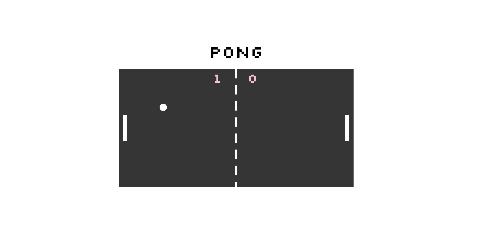

# Javascript Pong Game

A modern Javascript take on the classic arcade game using SVGs.

## Built With

* [jQuery](https://jquery.com/)

* [CSS3](https://developer.mozilla.org/en-US/docs/Learn/CSS/Introduction_to_CSS)

## Personal learnings

* First time working with SVGs
* First time being fully immersed in Javascript with minimal HTML5 and CSS3
* This project challenged my designer way of thought and helped me transition into a programming mindset.

## Authors

* **Karla Gonzalez** - [KARLAPAULINA](https://github.com/karlapaulina)

## Setup

* **Install dependencies:**

    `> npm i`

* **Run locally with Webpack Dev Server:**

    `> npm start`

* **Build for production:**

    `> npm run build`

## Controls

**Player 1:**
* a: up
* z: down

**Player 2:**
* ▲ : up
* ▼: down
